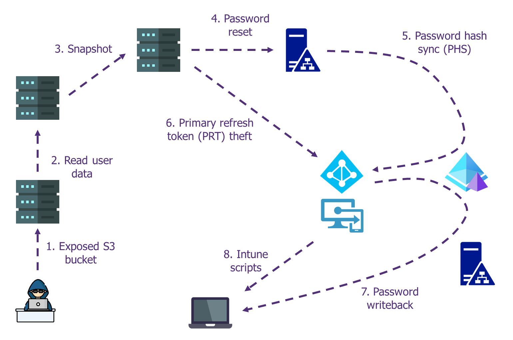

# Jumping from cloud to on-premises and the other way around

## Abstract

The use of the cloud is becoming more and more predominant in large companies. However, transitions from legacy infrastructure are sometimes done through "brutal" strategies (migration of 80% of the IS in 2 years). In fact, not all teams are properly trained to the new paradigm of security in the public cloud, leading therefore to blind spots in IS security.

This workshop aims to reintroduce the main principles of the public cloud (shared responsibility model, managed services, RBAC rights model), and to highlight the possible ways of elevating privileges within CSPs and lateralization between the management plane (CSP) and the data plane (AD).

## Detailed content

This workshop is intended to replay some of the attack paths exploited over the past 2 years on various companies. The main idea is to demonstrate that although an environment could be well secured at first looks (strong tiering isolation, up-to-date OS, and full EDR coverage), public Cloud misconfigurations can allow an attacker to avoid the use of legacy malicious action, therefore bypassing legacy security and detection measures, while having a maximum impact on confidentiality and availability.

You’ll learn how to:
- Identify resources relying on EC2
- Exploit EC2 instance metadata and user data
- Apprehend IAM policies and assume IAM roles
- Pivot to an AD forest through cloud backups and SAM database exploitation
- Jumping to Azure AD using password hash synchronization (PHS)
- Bypass MFA set up by conditional access policies with the primary refresh token (PRT)
- Pivot to another forest using password writeback
- Remote control workstations with the help of Intune

## Authors

- [Arnaud PETITCOL](https://www.linkedin.com/in/arnaud-petitcol)
- [Raymond CHAN](https://www.linkedin.com/in/raymond-chan-fr/)

## Acknowledgment

Special thanks to all the people who helped us to create this workshop, including:
- [Ayoub MELLAH](https://www.linkedin.com/in/ayoub-m-1003/) for his contribution to the build
- [Christian CHEN](https://www.linkedin.com/in/christianchn/) for his help on the lab design
- [François GREBOT](https://www.linkedin.com/in/fgrebot/) for his advice on infrastructure as code and PowerShell DSC
- [Younes LAABOUDI](https://www.linkedin.com/in/youneslaaboudi/) for his ideas and support

Kudos to all the people who shared their insights and their tools (see [References](#references)).

## History

- Workshop presented at BSides Las Vegas 2023: [Abstract](https://bsideslv.org/talks#KR7L3K) | [Slides](<https://github.com/wavestone-cdt/jumping-from-cloud-to-on-premises-and-the-other-way-around/blob/master/BSides23 - Jumping from cloud to on-premises and the other way around.pdf>)

## References

Tools
- AWS CLI
- AWS Consoler, https://github.com/NetSPI/aws_consoler
- mimikatz, https://github.com/gentilkiwi/mimikatz
- Sysinternals, https://learn.microsoft.com/en-us/sysinternals/
- BloodHound, https://github.com/BloodHoundAD/BloodHound
- AADInternals, https://github.com/Gerenios/AADInternals

## License

This project is licensed under the terms of the [CC BY 4.0 licence](https://creativecommons.org/licenses/by/4.0/)
